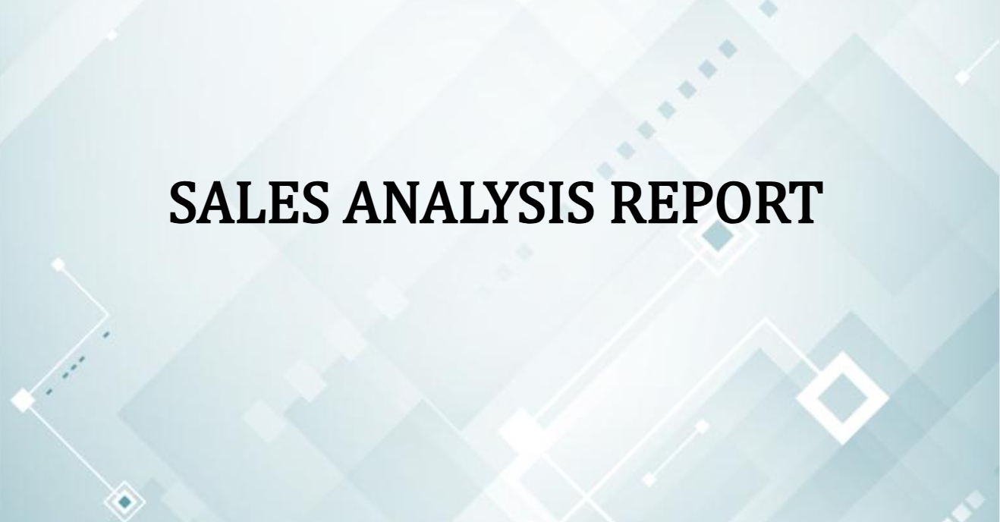
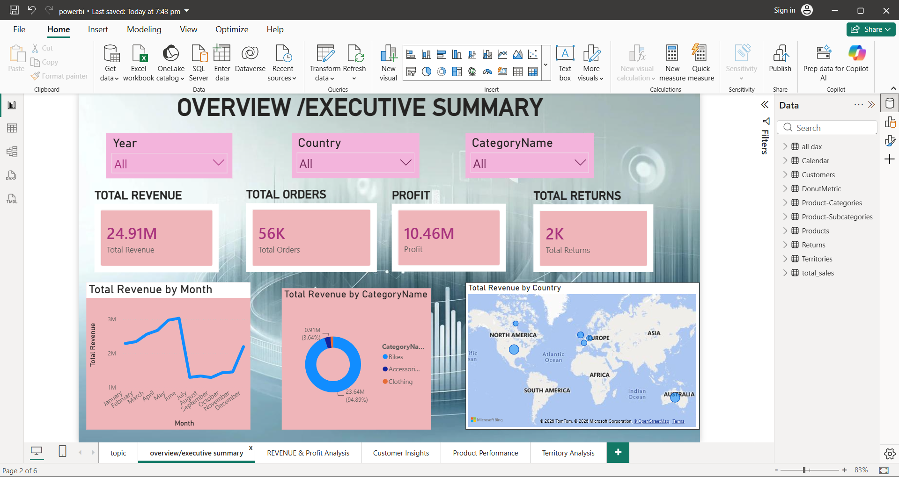
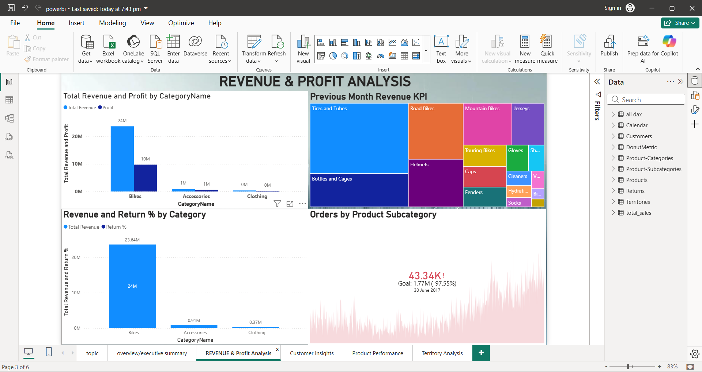
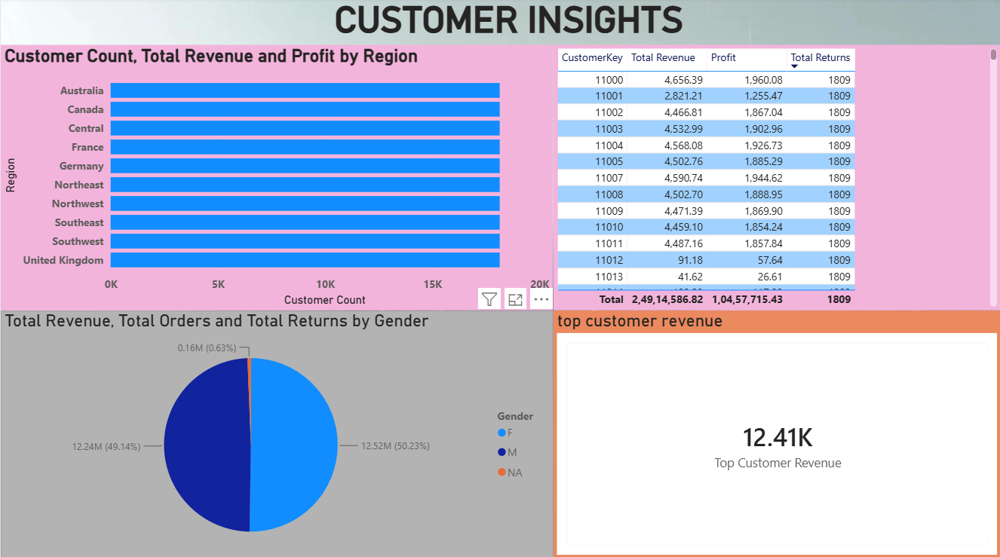
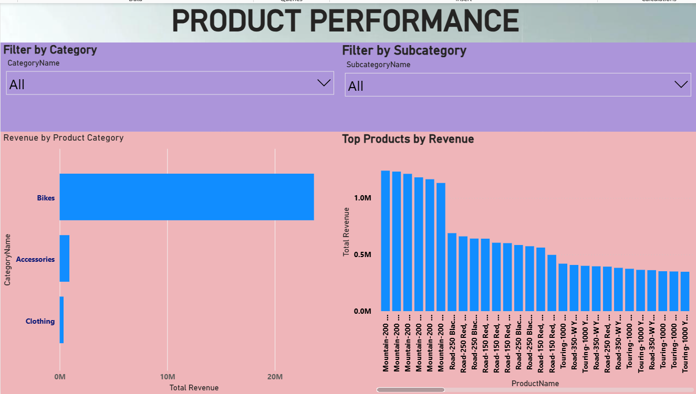
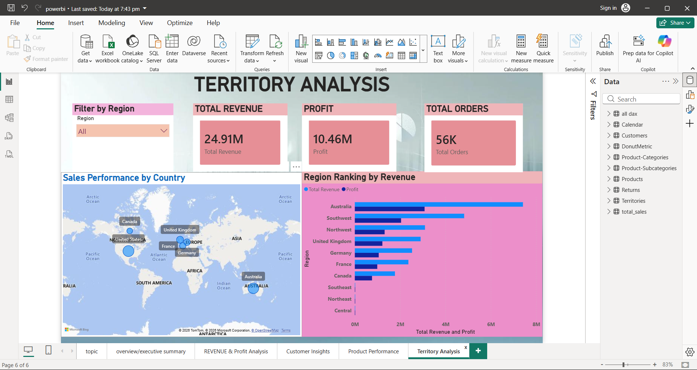

# 📊 Sales Analysis Dashboard

## 📌 Project Overview

This Power BI dashboard analyzes sales performance and provides insights into revenue, profit, customer behavior, product performance, and regional sales.

---

## 🛠 Tools Used

- Power BI
- Power Query
- DAX
- Excel

---

## 📷 Dashboard Screenshots

### Cover Page

---

### Overviewexecutive summary

---

### REVENUE & Profit Analysis

---

### Customer Insights

---

### Product Performance

---

### Territory Analysis

---

## 👩‍💻 Author

**Kowsalya.R**
